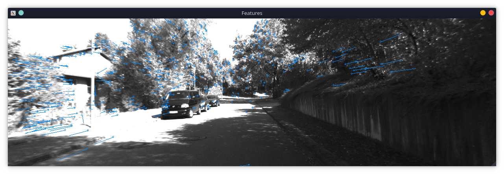

# toy-mvo
A toy monocular-visual odometry implementation.

The project receives frames from a forward-facing camera mounted on a car and using these frames, estimates which direction the car is traveling. The program is will then draw the estimated route as well as displaying the tracked features on top of the input frames. 

