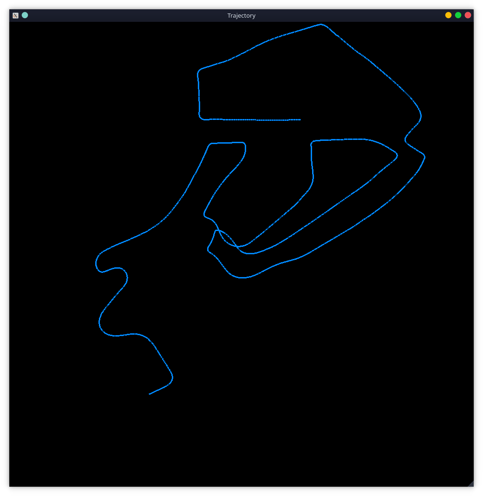

# toy-mvo
A toy monocular-visual odometry implementation.

**this is a personal project and some values/paths are hard-coded in**

The project receives frames from a forward-facing camera mounted on a car. It detects features using the FAST algorithm, and tracks them using the Lucas-Kanade method. It then calculates the essential matrix, which can then recover the car's pose and trajectory. The program will then draw the estimated route as well as displaying the tracked features on top of the input frames. 

Here is an example of the tracked features

And here is the estiamted trajectory

#